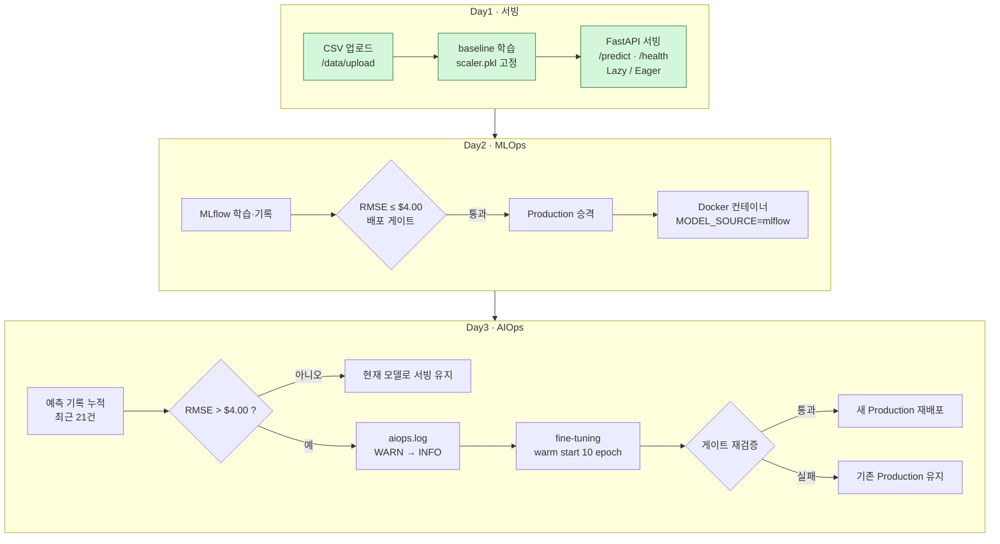
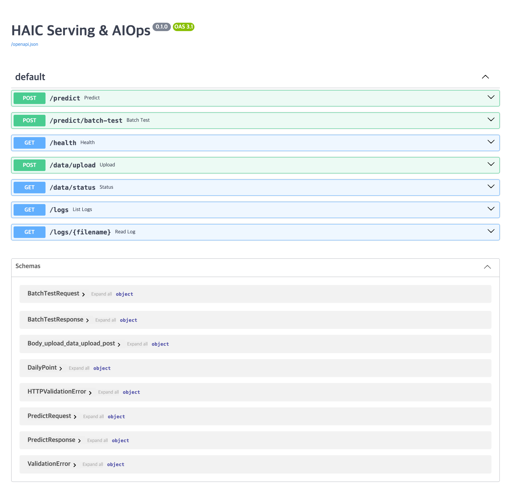
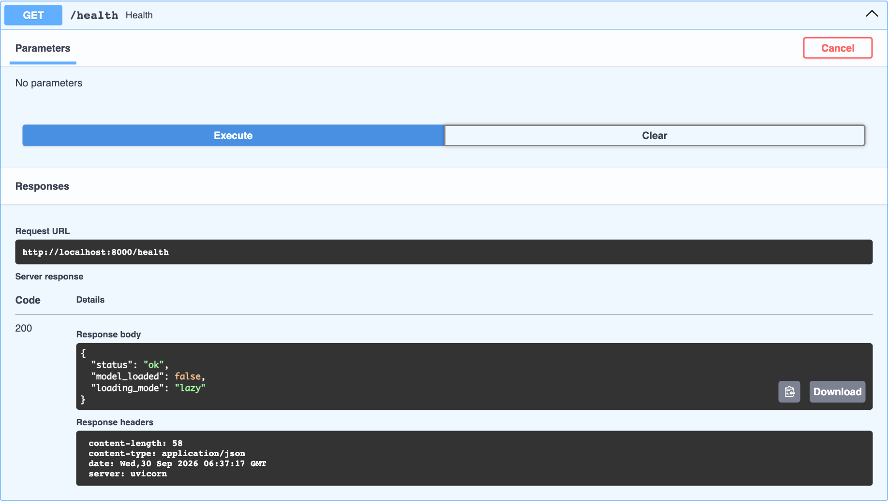
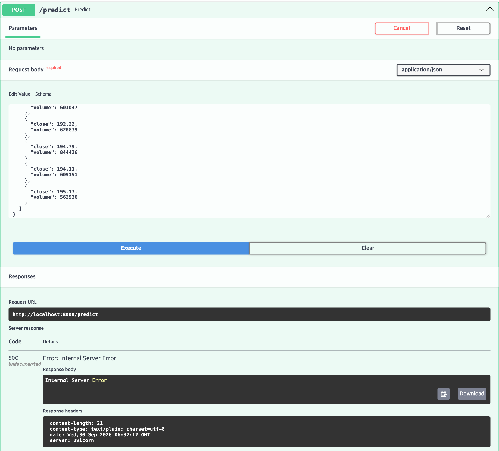
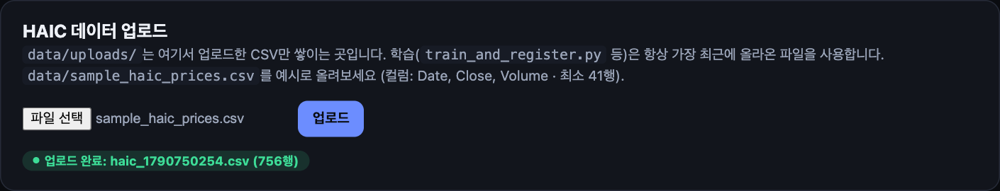
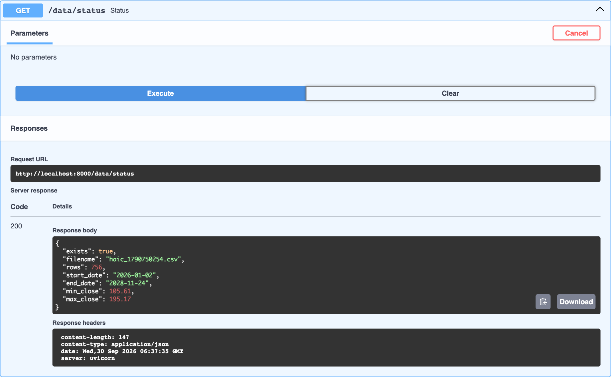
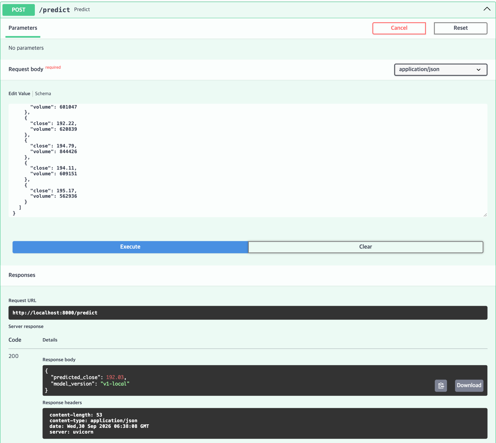
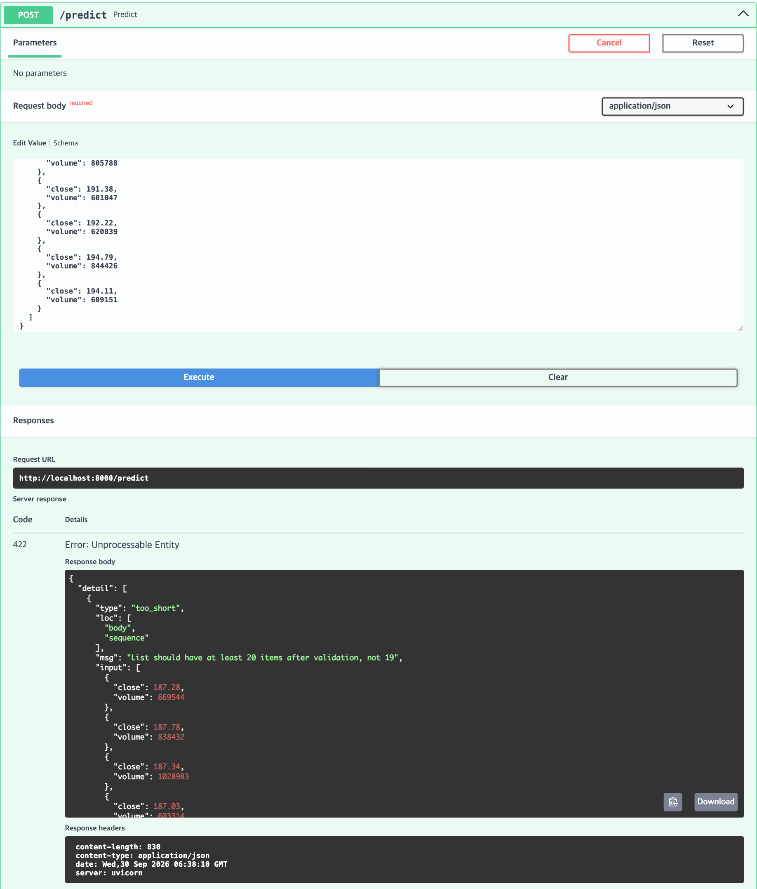
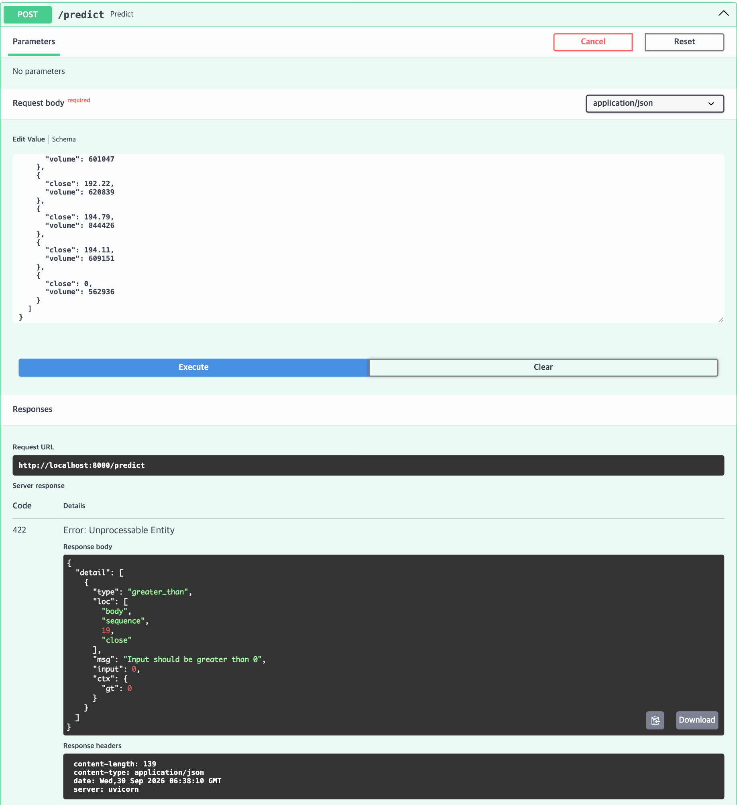
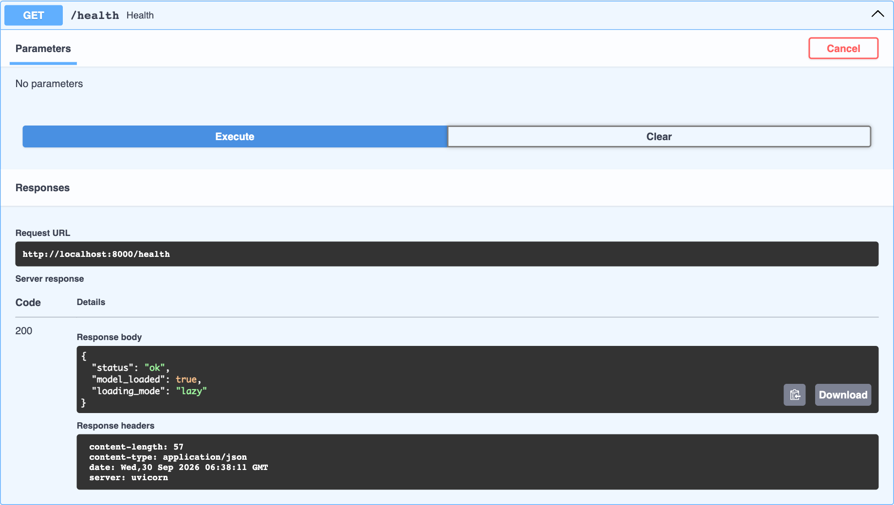

# 모델 서빙 및 AIOps 구성 — 실습 서브노트 (Day1 ~ Day3 누적)

> 작성자: ✏️ (이름/반/조) · 과정: SKALA AI 서비스를 위한 SW 기초 Full-stack Engineering
> 진행 현황: **Day1 완료** (2026-09-30) · Day2 예정 · Day3 예정
> 실행 환경: macOS (Apple Silicon), Python 3.11.15, fastapi 0.141.1, tensorflow 2.21.0, mlflow 3.16.0

> ✏️ 표시는 본인의 생각·경험으로 직접 보완할 부분입니다.

---

## 1. 이해관계자 가치 (Pain Point)

모델을 학습만 하고 서빙·운영 체계가 없다면 각 이해관계자는 다음과 같은 불편을 겪는다.

| 이해관계자 | Pain Point | 왜 중요한가 |
|---|---|---|
| **사용자** (투자 분석가) | 모델이 노트북(.ipynb) 안에만 있어 서비스에서 호출할 수 없음. 예측이 필요할 때마다 데이터 과학자에게 요청해야 함 | 예측 결과가 제때 전달되지 않으면 모델 가치가 0 |
| **운영자** | 서버가 "떠 있다"는 것과 "예측할 수 있다"는 것이 다름. 모델 파일이 없어도 서버는 정상 기동하고, 첫 요청에서야 500 에러가 발생함 (Day1 직접 확인 → 5번 증빙 ③) | 장애를 사용자가 먼저 발견하게 됨 |
| **모델 개발자** | 새 모델을 배포했는데 성능이 오히려 떨어져도 막을 장치가 없음 (Day2 배포 게이트로 해결 예정) | 어떤 버전이 서비스 중인지조차 추적 불가 |
| **경영진** | 시장 환경이 바뀌어도(2008 금융위기 같은 국면) 에러 없이 틀린 예측을 계속 내보냄 (Day3 드리프트 감지로 해결 예정) | "AI는 에러 없이 틀린다" → 손실이 조용히 누적 |

✏️ 본인이 겪었던/상상하는 사례 한 줄 추가

---

## 2. 이를 해결하기 위한 AI 솔루션

| 단계 | 기술 | 해결하는 Pain Point | 핵심 기능 |
|---|---|---|---|
| **서빙 (Day1)** | FastAPI + Pydantic + uvicorn | 모델을 "파일"에서 "서비스"로 | `/predict` REST API, 입력 스키마 검증(422), `/health` 헬스체크, Lazy/Eager 로딩 |
| **MLOps (Day2)** | MLflow Tracking·Registry, Docker | 모델을 "믿고 바꿀 수 있게" | 학습 기록, RMSE $4.00 배포 게이트, Production 승격, 단일 컨테이너 재현 |
| **AIOps (Day3)** | RMSE 슬라이딩 윈도우, aiops.log, fine-tuning | 모델이 "나빠져도 스스로 회복하게" | 드리프트 감지 → 알림 → warm-start 재학습 → 게이트 재검증 → 재배포 |

**Day1에서 확인한 서빙 계층의 역할**

- **FastAPI 라우터**: `predict`, `health`, `data`, `logs` 라우터를 기능별로 나누고 `main.py`에서 `include_router()`로 조립한 뒤, 마지막에 `StaticFiles`를 mount한다. 순서가 바뀌면 `/predict`를 정적 파일이 가로챈다.
- **Pydantic 스키마**: `PredictRequest.sequence`는 `min_length=max_length=20`이고, `DailyPoint.close`는 `gt=0`, `volume`은 `ge=0`이다. 학습 시점의 입력 형태 `(20, 2)`와 서빙 시점의 입력을 스키마 단계에서 강제로 일치시킨다.
- **model_loader**: `LOADING_MODE`(lazy/eager)와 `MODEL_SOURCE`(local/mlflow) 환경변수로 동작을 전환하는 "조립 블록" 구조다.

---

## 3. 아키텍처 구성도


> 초록색 = Day1에서 구현·검증 완료. Day2·Day3 진행하며 갱신.

**Day1 요청 처리 흐름 (실제 코드 기준)**
```
POST /predict
 → (Pydantic) PredictRequest 검증: 길이 20 · close>0 · volume≥0  ── 실패 시 422
 → predict() → model_loader.get_model()
      Lazy : _model_cache 비어 있으면 haic_v1.keras + scaler.pkl 로드 후 캐시
      Eager: startup 이벤트에서 이미 로드됨
 → scaler.transform_point() 로 (1, 20, 2) 정규화 → LSTM 예측 → inverse_close() 로 달러 복원
 → PredictResponse {predicted_close, model_version}
```

### 핵심 질문

**1) Lazy vs Eager — 직접 측정 결과** (각 3회 측정, 동일 입력, 로컬 MacBook CPU)

| 항목 | Lazy (평균) | Eager (평균) | 차이 |
|---|---|---|---|
| 서버 시작 시간 (프로세스 실행 → `/health` 200) | **0.27 s** | **2.82 s** | Eager가 약 10배 느림 |
| 첫 `/predict` 응답 시간 | **3.11 s** | **0.18 s** | Lazy가 약 17배 느림 |
| 두 번째 `/predict` 응답 시간 | 0.024 s | 0.018 s | 거의 동일 |
| 서버 콘솔 모델 로드 시간 | 4.01 / 2.74 / 2.21 s | 2.09 / 2.71 / 2.76 s | 로드 비용 자체는 비슷 (≈2~3 s) |
| 기동 직후 `/health` | `model_loaded: false` | `model_loaded: true` | |

<details><summary>원시 측정값 (3회)</summary>

| mode | run | 시작 (s) | 첫 요청 (s) | 두 번째 요청 (s) |
|---|---|---|---|---|
| lazy | 1 | 0.308 | 4.149 | 0.024 |
| lazy | 2 | 0.259 | 2.856 | 0.022 |
| lazy | 3 | 0.253 | 2.333 | 0.025 |
| eager | 1 | 2.267 | 0.172 | 0.018 |
| eager | 2 | 3.095 | 0.180 | 0.018 |
| eager | 3 | 3.104 | 0.185 | 0.017 |
</details>

**해석**

- 모델 로드 비용(약 2~3초)은 사라지지 않는다. **언제 지불하느냐**의 차이다. Lazy는 첫 사용자에게, Eager는 서버 기동 시점에 비용이 전가된다.
- Eager의 첫 요청도 0.18초로, 두 번째 요청(0.018초)보다 약 10배 느렸다. 모델 파일 로드와는 별개로, TensorFlow가 첫 `predict()` 호출 때 연산 그래프를 준비하는 워밍업 비용으로 보인다. 완전한 Eager를 원한다면 startup에서 더미 입력으로 한 번 예측해 두는 방법(warm-up)도 고려할 수 있다.
- Lazy는 **오류가 늦게 드러난다**. 모델 파일이 없는 상태에서도 서버는 0.3초 만에 떴고 `/health`도 `status: ok`였지만, 첫 `/predict`에서 500이 났다 (5번 증빙 ②·③).

**실제 서비스라면**

- **Eager**: 컨테이너나 쿠버네티스처럼 헬스체크를 통과해야 트래픽을 받는 운영 환경에 맞다. 모델 문제를 배포 시점에 바로 발견할 수 있고, 첫 사용자도 빠른 응답을 받는다. Day2 Dockerfile이 `LOADING_MODE=eager`인 이유이기도 하다.
- **Lazy**: 개발 중 `--reload`로 자주 재시작할 때나, 모델이 여러 개인데 일부만 호출되는 경우에 맞다. 시작이 빠르고 메모리를 아낄 수 있다.
- ✏️ 본인 판단 한 줄 (예: 우리 팀 서비스라면 ○○ 이유로 ○○ 선택)

**2) 학습 시점과 서빙 시점의 일치**

- **왜 20거래일 시퀀스인가?** 모델은 `(SEQ_LEN=20, 2)` 모양의 입력으로 학습됐다(`data/features.py`의 `build_sequences`). 서빙 입력의 모양이 다르면 예측 자체가 불가능하거나 의미가 없다. 그래서 스키마에서 `min_length=max_length=20`으로 강제했고, 19개를 보내면 모델까지 가기 전에 422로 거부된다 (증빙 ⑦).
- **왜 scaler.pkl은 Day1에 한 번만 fit하는가?** 모델 가중치는 Day1에 fit한 min-max 기준(종가 105.61~195.17)으로 정규화된 값에 맞춰 학습됐다. 나중에 스케일러를 다시 fit하면 같은 $190이 다른 숫자로 변환되어 기존 가중치와 어긋나고, fine-tuning도 의미를 잃는다. 전처리 코드를 `data/features.py` 한 곳에서 관리하는 것도 같은 이유다.

**3) 배포 게이트** — ✏️ Day2 진행 후 작성 (`[GATE PASSED]/[GATE FAILED]` 결과 근거)

**4) 드리프트 판정 기준** — ✏️ Day3 진행 후 작성 (정상/드리프트 배치의 실제 RMSE 근거)

**5) 재학습 방식** — ✏️ Day3 진행 후 작성

---

## 4. 트러블 슈팅

| # | 오류 메시지 / 증상 | 원인 | 해결 명령 / 조치 | 해결 전 → 후 |
|---|---|---|---|---|
| 1 | `POST /predict` → **500 Internal Server Error**<br/>서버 로그: `ValueError: File not found: filepath=serving_app/models/haic_v1.keras` | Lazy 모드라 서버는 모델 없이 기동됨. 첫 요청 시점에 모델을 로드하려다 파일이 없어 실패 | ① 대시보드에서 `data/sample_haic_prices.csv` 업로드<br/>② `python scripts/train_baseline_v1.py` | 500 → **200** `{"predicted_close": 192.03, "model_version": "v1-local"}` |
| 2 | `POST /predict` → **422** `too_short` · `List should have at least 20 items after validation, not 19` | 시퀀스 19개. `PredictRequest.sequence`의 `min_length=20` 위반 | 오류가 아니라 스키마가 의도대로 동작한 것. 20개로 수정 | 422 → 200 |
| 3 | `POST /predict` → **422** `greater_than` · `loc: [body, sequence, 19, close]` · `Input should be greater than 0` | 20번째 날 `close=0`. `DailyPoint.close`의 `gt=0` 위반 | `loc`으로 정확한 위치(19번 인덱스의 close)를 찾아 수정 | 422 → 200 |
| 4 | (사전 발견) README 예시는 `--port 8077`, 실습 가이드는 8000 | 문서 간 포트 불일치. `simulate_drift.py`의 `API_URL`과 Dockerfile은 8000 사용 | 8000으로 통일해 실행: `uvicorn serving_app.main:app --host 0.0.0.0 --port 8000` | Day3 `Connection refused` 예방 |
| 5 | (사전 발견, fastapi_practice) README의 `python3.11 -m venv fastapi && source .venv/bin/activate` | 생성한 가상환경 이름(`fastapi`)과 활성화하는 경로(`.venv`)가 다름 → 그대로 실행하면 활성화 실패 | `python3.11 -m venv .venv && source .venv/bin/activate` | 가상환경 정상 활성화 |

✏️ 직접 겪은 오류가 있다면 같은 형식으로 추가

**용어·요소 기술 연결 정리**

- **422 vs 500**: 422는 요청이 스키마와 맞지 않을 때 **클라이언트 탓**으로 거부하는 것이고, 핸들러 코드는 실행되지 않는다. 500은 핸들러 실행 중 잡지 못한 예외로 **서버 탓**이다.
- **Lazy 캐시**: `model_loader._model_cache`. 한 번 로드하면 프로세스가 살아 있는 동안 재사용한다. Day3에서 재학습 후 캐시를 비우지 않으면 예전 모델이 계속 응답하는 원인이 된다 (가이드 부록 1-6).
- **`/health`의 두 의미**: `status: ok`는 프로세스가 살아 있다는 뜻이고, `model_loaded`는 예측할 준비가 됐다는 뜻이다. 운영에서는 두 가지를 구분해야 한다 (liveness vs readiness).

---

## 5. 레퍼런스

### 5-1. 강의 키워드 요약 (Day1)

- **서빙의 위상**: 모델은 API로 감싸는 순간 "파일"에서 "서비스"가 된다. 실무 AI 프로젝트는 학습 이후 단계에서 더 많이 실패한다.
- **서빙 아키텍처**: Training vs Serving, 배치 vs 실시간, REST/gRPC, 동기/비동기
- **FastAPI 구조**: `FastAPI()` → `APIRouter(prefix)` → `@router.get/post` → Pydantic 스키마 → `include_router()` → `StaticFiles`는 마지막에 mount
- **요청 처리 순서**: URL 매칭 → Pydantic 검증 → 핸들러 실행 → return 값이 JSON으로 직렬화
- **def vs async def**: `await`로 기다릴 I/O가 있을 때만 `async`를 쓴다. 이 프로젝트에서는 업로드 핸들러 하나뿐이다.
- **서빙 안정성**: 입력 검증(422), 에러 핸들링(HTTPException 400 / 미처리 500), 헬스체크, Lazy/Eager 로딩
- ✏️ 수업 중 교수님이 강조한 내용 추가

### 5-2. Day1 필수 증빙

**① Swagger UI (`/docs`)**


**② Lazy 기동 직후 `/health`: 서버는 ok인데 모델은 미로드**


**③ 모델 파일 없이 `/predict` 호출 → 500 (Lazy의 "늦게 드러나는 오류")**

```
ValueError: File not found: filepath=serving_app/models/haic_v1.keras. Please ensure the file is an accessible `.keras` zip file.
```

**④ 대시보드 CSV 업로드 → `/data/status`**



**⑤ `train_baseline_v1.py` 실행 로그 (baseline v1 RMSE)**
```
$ python scripts/train_baseline_v1.py
scaler fit on 756행 -> serving_app/models/scaler.pkl
baseline v1 RMSE = 2.87  (배포 게이트: $4.00)
saved -> serving_app/models/haic_v1.keras
real 15.43
```
→ 테스트 구간(시간순 뒤 20%) RMSE **$2.87**로 게이트 $4.00 이내다. 100 epoch 학습에 약 15초가 걸렸다 (CPU).

**⑥ `/predict` Try it out → 200 (`predicted_close`, `model_version`)**

> 입력: 2028-10-27 ~ 2028-11-23 (20거래일) → 예측 **$192.03** / 실제 다음 거래일(2028-11-24) 종가 **$192.71** (오차 $0.68)

**⑦ 잘못된 입력 → 422 검증 오류**

시퀀스 19개 (`too_short`)


`close = 0` (`greater_than`, `loc: [body, sequence, 19, close]`)


**⑧ `/health`의 Lazy / Eager 차이**

| Lazy: 첫 요청 이후 `model_loaded: true` | Eager: 기동 직후부터 `model_loaded: true` |
|---|---|
|  |  |

**⑨ Lazy vs Eager 측정표**: 3번 핵심 질문 1) 표 참조. 서버 콘솔 로그는 아래와 같다.
```
[lazy] 모델은 첫 /predict 요청이 들어올 때 로드됩니다.
[lazy] model loaded in 4.010s on first request
[lazy] model loaded in 2.740s on first request
[lazy] model loaded in 2.208s on first request
[eager] model loaded in 2.087s at startup
[eager] model loaded in 2.712s at startup
[eager] model loaded in 2.756s at startup
```

### 5-3. Day2 필수 증빙 — ✏️ 예정

- `train_and_register.py` 로그(`[GATE PASSED]`/`[GATE FAILED]`), MLflow params·metric
- `_load_from_mlflow()` 구현 코드, `MODEL_SOURCE=mlflow`에서의 `/predict` 응답 (`model_version: production`)
- `docker compose up --build` 로그, 컨테이너 `/docs` 화면
- ML 라이프사이클 매핑 한 장 요약

### 5-4. Day3 필수 증빙 — ✏️ 예정

- TODO 4개 구현 코드, `simulate_drift.py` 결과, `aiops.log`의 WARN → INFO → OK 로그, 재학습 후 `/predict`
