# 모델 서빙 및 AIOps 구성 실습 서브노트 (Day1 ~ Day3 누적)

- 작성: SKALA 6반 6조 · P195 이민기
- 실습 기간: 2026-09-30 (Day1) ~ 2026-10-02 (Day3, 조별 발표), 최종 정리 2026-10-03
- 실습 위치: `project/` (HAIC 스켈레톤). 조별 과제는 `project_solar/` (해아림)
- 환경: Python 3.11, fastapi 0.141, tensorflow 2.21, mlflow 3.16

---

## 0. 전체 결과 요약

| Day | 항목 | 결과 |
|---|---|---|
| 1 | baseline RMSE | $2.43 (100 epoch, 38초). 게이트 $4.00 이내 |
| 1 | /predict 정상·비정상 | 20거래일 → 200, predicted_close 191.68 (실제 192.71) / 19개·close=0 → 422 |
| 1 | Lazy vs Eager (3회 평균) | Lazy 시작 0.42초·첫 요청 3.96초 / Eager 시작 3.76초·첫 요청 0.46초 |
| 2 | train_and_register | `[GATE PASSED] rmse=2.03 -> HAIC_Predictor v1 promoted to Production` |
| 2 | MODEL_SOURCE=mlflow | /predict 응답 model_version이 `production-v1` |
| 2 | Docker | 컨테이너는 실행하지 못함(5-3 ④). Dockerfile의 RUN 단계를 같은 순서로 직접 실행해 확인 |
| 3 | 정상 배치 | `drift_check = {'status': 'ok'}` |
| 3 | 드리프트 배치 | `retrain_triggered, promoted: True`, 재학습 RMSE 1.47 (v2), 1.69 (v3) |
| 3 | aiops.log | 재학습마다 WARN → INFO → OK 세 줄(v2, v3 두 번), 감지부터 승격까지 11초 |
| 3 | 재학습 전후 /predict | 캐시를 비우지 않으면 v2 승격 뒤에도 `production-v1` 그대로. 비우면 재시작 없이 `production-v2` → `production-v3` |

실습가이드 9번 완료 기준 8개는 모두 확인했다. 마지막 항목(재배포 후 새 버전이 응답하는가)은 처음에는 실패했고 코드를 수정한 뒤 통과했다. 수정 전후 상태를 모두 로그로 남겼다(4-7).

---

## 1. 이해관계자 가치 (Pain Point)

수업 첫 시간에 교수님이 하신 말 중 가장 기억에 남는 것이 "3개월 박수"였다. 데이터 사이언티스트가 공장에 들어가 모델을 잘 만들어 놓으면 3개월은 박수를 받지만, 3개월이 지나면 맞지 않는다는 전화가 온다는 이야기였다. Day3에 드리프트 배치를 넣어 보니 그 상황이 그대로 재현됐다. 서버는 정상적으로 200을 돌려주는데 값만 틀린다. 교수님 표현대로 "AI는 에러 없이 틀린다".

### 1-1. 모델이 노트북에만 있을 때 (Day1)

| 이해관계자 | 서빙이 없으면 |
|---|---|
| 사용자(투자 분석가) | 예측값이 필요할 때마다 데이터 과학자에게 요청해야 한다. |
| 운영자 | 모델이 떠 있는지 알 방법이 없다. 사용자가 먼저 발견한다. |
| 모델 개발자 | 학습 때와 다른 형태의 입력이 들어와도 막을 지점이 없다. |
| 경영진 | 학습에 비용을 썼는데 서비스에 연결되지 않아 얻는 것이 없다. |

실제로 겪은 사례로는, Day1에 Lazy로 서버를 띄웠을 때 모델 파일이 없는데도 `/health`가 `status: ok`였다. 운영자가 이 값만 보고 있었다면 장애를 알 수 없었을 것이다. 서버가 살아 있는 것과 예측할 준비가 된 것은 다른 상태다. Day1에서 가장 분명하게 확인한 부분이다.

### 1-2. 모델을 바꿔 배포했는데 무엇이 바뀌었는지 모를 때 (Day2)

Day2에서 `train_and_register`를 실행하면 `HAIC_Predictor v1`이 등록된다. Day3에서 재학습이 실행될 때마다 v2, v3가 쌓인다. 그런데 Registry 목록을 조회해 보니 세 버전이 모두 `Production`이었다(4-6). 버전 번호가 있어도 현재 서빙 중인 버전은 따로 확인해야 하는 정보였다.

| 이해관계자 | 버전 관리와 게이트가 없으면 |
|---|---|
| 모델 개발자 | 어떤 실험이 더 나았는지 기억에 의존한다. |
| 운영자 | 방금 배포한 모델이 전보다 나은지 모르는 채 트래픽을 받는다. |
| 경영진 | 성능이 나쁜 모델이 실수로 배포되는 것을 막을 장치가 없다. |

### 1-3. 모델이 조용히 나빠질 때 (Day3)

Day1, Day2는 문제가 생기면 에러가 났다. Day3는 다르다. 드리프트 배치를 넣었을 때 서버 로그 어디에도 에러가 없었고, 최근 21건 RMSE만 커졌다. 또한 재학습이 실행됐다는 로그와 서빙에 반영된 것은 별개라는 점을 4-7에서 확인했다. `[OK] production promoted`가 기록됐는데 `/predict` 응답은 그대로였다. 로그만 보고 완료로 판단했다면 아무것도 바뀌지 않은 서비스를 계속 운영했을 것이다.

| 이해관계자 | 모니터링과 드리프트 감지가 없으면 |
|---|---|
| 사용자 | 모르는 사이에 틀린 예측으로 의사결정한다. |
| 운영자 | 항의가 쌓이기 전까지 모른다. |
| 모델 개발자 | 언제부터 나빠졌는지 나중에 로그를 뒤져 역추적해야 한다. |

조별 과제에서는 같은 구조를 태양광 발전소에 적용했다. 전력중개사업자는 매일 아침 10시 전에 다음 날 24시간 발전량을 제출해야 하고, 오차가 크면 그날 정산을 받지 못한다. 여기서 Pain Point가 하나 더 생겼다. 오차가 커졌을 때 그 원인이 날씨인지 설비 고장인지 모델 노후인지 구분할 수 없다는 점이다. HAIC에는 없던 문제였다.

---

## 2. 이를 해결하기 위한 AI 솔루션

교수님이 "와이어링"이라는 표현을 반복해서 쓰셨다. 머신러닝, 딥러닝, 백엔드, 프론트, 랭체인을 각각 따로 배웠는데, 그것을 연결해서 운영되게 만드는 것이 AIOps라는 뜻이었다. 3일 실습이 그 연결 과정에 해당했다.

| Day | 기술 | 역할 | 내가 확인한 것 |
|---|---|---|---|
| 1 | FastAPI 라우터, Pydantic 스키마 | 모델을 API로 감싸고, 학습 때와 같은 형태의 입력만 통과시킨다 | 19개·close≤0은 모델에 닿기 전에 422 |
| 1 | /health, Lazy/Eager | 서버 상태와 모델 로딩 여부를 외부에 알리고, 로딩 비용을 언제 부담할지 선택한다 | 3-1 측정표 |
| 2 | MLflow Tracking | 학습마다 파라미터·RMSE·모델 파일을 기록한다 | run마다 mode, epochs, rmse |
| 2 | Model Registry, 배포 게이트 | RMSE ≤ $4를 통과한 버전만 Production으로 올린다 | `[GATE PASSED] rmse=2.03 -> v1` |
| 2 | _load_from_mlflow() | 서버가 버전 번호가 아니라 Production 단계를 바라보게 한다 | model_version이 production-v1 |
| 2 | Dockerfile | 의존성과 학습·등록 과정을 이미지에 고정한다 | RUN 단계를 같은 순서로 직접 실행 |
| 3 | drift_detector.py | 최근 21건 RMSE를 $4와 비교한다 | 정상 ok, 드리프트 재학습 |
| 3 | retrain_trigger.py | warm start fine-tuning, 게이트 재검증, 승격, 캐시 비우기 | WARN, INFO, OK 로그 |
| 3 | simulate_drift.py | 정상 변동성과 3배 변동성 입력을 만들어 루프를 검증한다 | send_batch 구현 |

수업에서 "FastAPI는 모델 서빙용으로만 쓴다"는 것도 처음 알았다. 파이썬은 컴파일이 되지 않아 컨테이너를 열면 코드가 그대로 보이고, 패키지 버전 종속성이 자주 꼬이기 때문에 엔터프라이즈 백엔드는 스프링 부트로 만들고 추론 엔진만 FastAPI로 둔다는 설명이었다. 지금까지는 FastAPI로 무엇이든 만들 수 있다고만 생각했는데, 역할이 정해져 있다는 점이 새로웠다.

---

## 3. 아키텍처 구성도

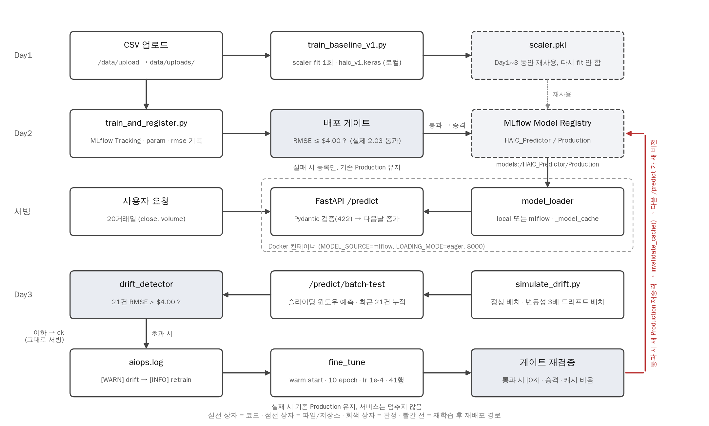

그림 1. 업로드부터 재배포까지 전체 흐름 (HAIC 실습 기준). 실선 상자는 코드, 점선 상자는 파일과 저장소, 회색 상자는 판정, 빨간 선은 재학습 뒤 재배포 경로.

scaler.pkl은 Day1에 한 번 fit한 뒤 Day3까지 그대로 쓴다. train_and_register도 fine_tune도 `HAICScaler.load()`로 읽기만 한다.

### 3-1. 핵심 질문 1) Lazy vs Eager (Day1)

같은 20거래일 입력으로 모드마다 서버를 새로 띄워 3회씩 측정했다. 시작 시간은 프로세스 실행부터 `/health` 200까지, 요청 시간은 `/predict`를 연속 2회. 첫 표가 평균, 둘째 표가 3회 원시값(초)이다.

| 항목 | Lazy (평균) | Eager (평균) |
|---|---|---|
| 서버 시작 | 0.42 s | 3.76 s |
| 첫 /predict | 3.96 s | 0.46 s |
| 두 번째 /predict | 0.072 s | 0.064 s |
| 시작 직후 /health | model_loaded: false | model_loaded: true |

| mode | run | 시작 | 첫 요청 | 두 번째 | 서버 콘솔 model loaded |
|---|---|---|---|---|---|
| lazy | 1 | 0.423 | 3.947 | 0.076 | 3.565 (on first request) |
| lazy | 2 | 0.421 | 3.927 | 0.077 | 3.531 |
| lazy | 3 | 0.424 | 3.995 | 0.062 | 3.584 |
| eager | 1 | 3.558 | 0.414 | 0.062 | 3.105 (at startup) |
| eager | 2 | 3.924 | 0.489 | 0.067 | 3.491 |
| eager | 3 | 3.810 | 0.492 | 0.064 | 3.369 |

해석. 모델 로드 비용 3초대는 없어지지 않는다. 그 비용을 누가 부담하느냐가 다를 뿐이다. Lazy는 첫 사용자가 부담하고 Eager는 서버가 뜰 때 부담한다. 시작과 첫 요청을 합치면 Lazy 4.38초, Eager 4.22초로 거의 같다.

Eager인데도 첫 요청이 0.46초로 두 번째 0.064초보다 7배 느린 점은 의문이었다. 모델 파일은 이미 읽은 상태이므로, TensorFlow가 첫 `predict()` 호출 때 연산 그래프를 준비하는 비용으로 보인다. 기동 시 더미 입력으로 한 번 예측해 두면 없앨 수 있을 것이다.

실제 서비스라면. 교수님이 "정답은 없고 상황에 따라 다르다"고 하셨는데, 측정해 보니 기준이 생겼다. 컨테이너나 쿠버네티스처럼 헬스체크를 통과해야 트래픽을 받는 환경이면 Eager가 맞다. 모델 파일이 깨져 있으면 기동 단계에서 바로 실패하므로 잘못된 버전이 트래픽을 받기 전에 걸러진다. Day2 Dockerfile이 `LOADING_MODE=eager`인 이유도 그 때문이다. 개발 중에 `--reload`로 자주 재시작하거나 어떤 모델을 쓸지 나중에 정해지는 경우는 Lazy가 낫다. 조별 과제에서도 컨테이너는 Eager, 로컬 개발은 Lazy로 나눴다.

### 3-2. 핵심 질문 2) 학습 시점과 서빙 시점의 일치 (Day1)

왜 20거래일 시퀀스인가. 모델이 `Input(shape=(SEQ_LEN, 2))`로 학습됐기 때문이다. `PredictRequest`가 `data/features.SEQ_LEN`을 import해서 `min_length=max_length=20`으로 강제한다. 숫자를 스키마에 따로 적어 두면 나중에 입력 길이를 바꿀 때 한쪽만 바뀌어 어긋난다. 19개를 보내면 모델까지 가지 않고 422에서 끝난다.

왜 scaler.pkl은 Day1에 한 번만 fit하는가. 가중치가 Day1 min-max 기준(종가 105.61~195.17)으로 변환된 숫자에 맞춰 학습돼 있다. 중간에 다시 fit하면 같은 $190이 다른 숫자로 변환되어 가중치와 맞지 않는다. fine_tune도 의미를 잃는다. 빈칸 5가 `HAICScaler.load(SCALER_PATH)`인 이유다. 교수님이 말씀하신 "에러 없이 결과만 틀어지는 조용한 실패"가 바로 이 지점이다. 다시 fit해도 에러는 나지 않는다.

### 3-3. 핵심 질문 3) 배포 게이트 (Day2)

게이트가 없다면. `_register_if_gate_passed()`는 `score <= RMSE_GATE`일 때만 Production으로 올린다. 이 조건이 없으면 학습이 끝난 모든 버전이 Production이 된다. 좋은 모델과 나쁜 모델을 구분할 수 없다.

통과하지 못한 버전은. MLflow run으로 기록만 남고 Registry Production으로 올라가지 않는다. 서버는 `models:/HAIC_Predictor/Production`만 보기 때문에 탈락한 버전은 서버 입장에서 없는 것과 같다. 기존 Production이 계속 서빙된다.

운영자에게 주는 가치. 배포하는 사람과 배포 가능 여부를 판단하는 기준을 분리한다. 내 v1은 2.03으로 통과했지만, $4를 넘겼다면 콘솔에 `[GATE FAILED]`만 기록되고 서비스는 그대로였을 것이다. 실패가 서비스 중단이 아니라 "변경 없음"으로 처리된다는 점이 합리적이라고 생각했다.

### 3-4. 핵심 질문 4) 드리프트 판정 기준 (Day3)

윈도우와 임계값을 바꾸면. 윈도우를 5건처럼 짧게 잡으면 며칠 우연히 어긋나도 드리프트로 판정한다(오탐). 100건처럼 길게 잡으면 실제 드리프트가 시작돼도 평균이 기준을 넘기까지 오래 걸린다(미탐). 임계값도 낮추면 오탐, 높이면 미탐이 늘어난다. 21건은 한 달 거래일 수를 기준으로 잡은 절충점이다.

실제 결과.

- 정상 배치 (일별 변동성 1.2%): `{'status': 'ok'}`
- 드리프트 배치 (변동성 3배): `{'status': 'retrain_triggered', 'promoted': True, 'rmse': 1.47}`

여기서 처음에 잘못 이해했다. 응답의 `rmse: 1.47`을 보고 1.47인데 왜 드리프트로 판정됐는지 의문이었다. 코드를 다시 보니 이 값은 드리프트 판정에 쓴 RMSE가 아니라 재학습 직후 게이트 재검증에 쓴 RMSE였다. 판정용 RMSE(`compute_rmse()`로 최근 21건을 계산해 $4를 넘은 값)는 응답에 들어가지 않는다. 감지 오차와 재학습 평가 오차가 서로 다른 값이라는 점은 숫자만 보면 지나치기 쉬운 부분이었다.

조별 과제에서는 임계값을 고정값으로 두지 않고 검증 오차의 1.25배로 유도했다. 고정 8%를 썼더니 모델의 평상시 오차가 8.3%라 매일 드리프트가 발생했기 때문이다. HAIC는 $4 고정이라 이 문제가 드러나지 않았는데, 실제 데이터를 넣자 바로 나타났다.

### 3-5. 핵심 질문 5) 재학습 방식 (Day3)

scratch가 아니라 fine-tuning인 이유. 빈칸 10을 채우면서 직접 선택해야 했다. 최근 21거래일에 창문 20일을 더한 41행으로 파라미터 1.6만 개의 LSTM을 처음부터 학습하면 샘플이 부족해 불안정하다. 3년치로 학습된 Production 가중치에서 10 epoch만 이어서 학습한다. 학습률도 1e-4로 base(1e-3)보다 낮게 두어 기존 가중치를 크게 바꾸지 않는다. Registry에 남은 run 파라미터에 이 차이가 그대로 기록된다. v1은 `mode=scratch, epochs=100`, v2·v3는 `mode=fine-tune, epochs=10, n_rows=41`.

재학습 모델이 게이트를 넘지 못하면. fine_tune도 Day2와 같은 `_register_if_gate_passed()`를 거친다. 탈락하면 기존 Production이 그대로 남고 서비스는 멈추지 않는다. 빈칸 11이 "promoted일 때만 OK 로그"인 이유다. 재학습을 시도한 것과 서비스가 바뀐 것은 다르다. 4-7에서 더 분명하게 확인했다.

---

## 4. 트러블 슈팅

오류 메시지, 원인, 해결, 결과 순서로 정리했다.

### Day1

**4-1. 모델 없이 /predict → 500**
- 오류: `ValueError: File not found: filepath=serving_app/models/haic_v1.keras`
- 원인: Lazy 모드라 서버는 모델 없이 기동됐고, 첫 요청 때 로드하려다 파일이 없어 실패.
- 해결: 대시보드에서 CSV 업로드 후 `python scripts/train_baseline_v1.py`.
- 결과: 500 → 200 `{"predicted_close": 191.68, "model_version": "v1-local"}`.
- 배운 점: `/health`는 프로세스가 살아 있는 것만 알려주고 예측 준비가 됐는지는 알려주지 않는다. 운영에서는 `model_loaded`까지 확인해야 한다.

**4-2. /predict → 422 too_short, greater_than**
- 오류: `List should have at least 20 items after validation, not 19` / `Input should be greater than 0`, loc `[body, sequence, 19, close]`.
- 원인: 시퀀스 19개, close=0. 스키마 위반.
- 해결: 오류가 아니라 스키마가 의도대로 동작한 것이다. loc으로 위치를 찾아 입력을 고치면 된다.
- 배운 점: 교수님이 "규격을 잡지 않으면 에러가 오염돼 전파되고 어디서 발생했는지 모른다"고 하셨는데, 422는 핸들러가 실행되기 전에 끊어 주므로 원인이 바로 보인다. 500은 서버 쪽 문제, 422는 클라이언트 쪽 문제다.

**4-3. 포트 8000 vs 8077**
- 증상: README 예시는 `--port 8077`, 실습가이드와 `simulate_drift.py`의 API_URL은 8000.
- 원인: 문서 간 포트 불일치. 교수님도 2일차에 "8000으로 드린 게 하나 있는데 8077로 바꿔야 한다"고 안내.
- 해결: 로컬은 8000으로 통일해서 실행. 컨테이너도 Dockerfile대로 8000.
- 배운 점: README, Dockerfile, 스크립트 상수가 같은 포트를 가정하는지 먼저 확인해야 한다. 조별 과제에서는 환경변수 PORT로 분리하고 8010 하나로 맞췄다.

**4-4. 가상환경 이름과 활성화 경로 불일치**
- 증상: README가 `python3.11 -m venv fastapi && source .venv/bin/activate`.
- 원인: 만든 이름(fastapi)과 활성화하는 경로(.venv)가 다름.
- 해결: `python3.11 -m venv .venv && source .venv/bin/activate`.
- 조별 과제에서도 비슷한 환경 문제가 두 건 있었다. 셸의 `python3`가 다른 파이썬을 가리켜 pip이 가상환경 밖에 설치된 것(`No module named uvicorn`, `.venv/bin/python -m pip`으로 해결)과 `.gitignore`의 `*.keras` 때문에 동봉 모델이 클론에 빠진 것(해당 파일만 예외로 풀어 커밋).

### Day2

**4-5. transition_model_version_stage FutureWarning**
- 현상: `FutureWarning: transition_model_version_stage is deprecated since 2.9.0`. 서버 쪽 `get_latest_versions`에도 같은 경고.
- 원인: MLflow 3.x는 Stage 대신 alias(@champion) 방식을 권장. 실습 코드는 이전 API.
- 처리: 에러가 아니므로 실습은 그대로 진행. 조별 과제에서는 alias로 바꿨다. `models:/Haearim_Hourly@champion`으로 로드하고 승격은 alias 이동.

**4-6. Registry에 Production이 세 개**
- 현상: Day3까지 끝내고 버전 목록을 조회해 보니 v1, v2, v3가 전부 `stage=Production`이었다.
- 원인: `transition_model_version_stage(stage="Production")`만 호출하고 이전 버전을 Archived로 내리지 않는다. 서버가 쓰는 `get_latest_versions(stages=["Production"])`은 그중 가장 높은 번호를 돌려주므로 동작은 맞지만, 목록만 보면 어느 버전이 서빙 중인지 보이지 않는다.
- 처리: 실습 범위에서는 그대로 두고 `/predict` 응답에 버전 번호(`production-v3`)를 넣어 확인하는 방식으로 대응했다. 조별 과제에서는 alias로 바꿔 champion이 항상 하나만 있게 했다.
- 배운 점: "승격했다"는 로그보다 "현재 무엇이 Production인가"를 한 번에 조회할 수 있는 것이 운영에서는 더 중요하다.

### Day3

**4-7. [OK] promoted 로그는 기록됐는데 /predict 응답이 그대로**
- 현상: 드리프트 배치 전송 후 aiops.log에 `[OK] new_rmse=1.47 - production promoted: HAIC_Predictor v2`까지 기록됐다. 그런데 같은 입력으로 `/predict`를 다시 호출하니 `{"predicted_close":194.21,"model_version":"production-v1"}`. 재학습 전과 완전히 같았다.
- 원인: `model_loader.get_model()`은 `_model_cache`가 None일 때만 다시 읽는다. 서버가 처음 뜰 때 v1을 캐시에 올려 두면 이후 Registry가 v2로 바뀌어도 서버는 모른다. 캐시를 비우는 코드가 어디에도 없었다. 실습가이드 부록 1의 6번이 바로 이 증상이었다.
- 해결: `model_loader.py`에 `invalidate_cache()`(캐시를 None으로)를 만들고, `retrain_trigger.py`의 빈칸 11 안에서 `result["promoted"]`가 True일 때 호출하게 했다. 응답에 `production-v2`처럼 번호가 나오게 `_production_version_label()`도 추가했다.
- 결과: 수정한 코드로 서버를 다시 띄우면 v2를 읽는다(`195.19, production-v2`). 여기서 드리프트를 한 번 더 넣으면 v3가 승격되고, 재시작 없이 다음 요청이 `194.22, production-v3`로 바뀐다. 수정 전 상태는 `invalidate_cache()` 호출 한 줄만 주석 처리해 따로 재현했고, 둘 다 5-4에 남겼다.
- 배운 점: 3일 중 가장 크게 배운 부분이다. 로그에 성공이 기록된 것과 사용자에게 나가는 응답이 바뀐 것은 다르다. 교수님이 빈칸 11 주석에 "재학습이 실행됐다와 새 모델이 배포됐다는 같은 뜻일까요"라고 써 두셨는데, 그 질문이 캐시 문제까지 이어진다는 것은 직접 겪고 나서야 알았다. 운영 중인 서비스에서 이런 문제는 가장 늦게 발견되는 종류의 장애일 것이다.

**4-8. 응답의 rmse 1.47을 판정 RMSE로 오해**
- 현상: 3-4에 정리한 대로. 1.47은 재학습 후 게이트 재검증 값.
- 배운 점: 감지용 오차와 평가용 오차는 응답에서 구분해 내보내야 한다. 조별 과제에서는 `window_error`(판정)와 `new_error`(재학습 후)를 따로 반환하게 했다.

---

## 5. 레퍼런스

### 5-1. 강의 키워드 정리

수업 중 메모한 내용 중 이번 실습과 직접 연결되는 것만 정리했다.

| 키워드 | 정리 |
|---|---|
| 데이터는 업무의 결과 | 업무가 계속 조금씩 바뀌므로 데이터도 바뀌고, 한 번 학습한 모델은 시간이 지나면 맞지 않는다. 운영이 필요한 이유. |
| 3개월 박수 | 모델을 잘 만들어도 3개월 지나면 전화가 온다. 성능이 유지되게 운영하는 것이 MLOps, 파이프라인까지 함께 보는 것이 AIOps. |
| 와이어링 | 따로 배운 머신러닝, 백엔드, 프론트를 연결해서 운영으로 완성하는 것. |
| FastAPI는 추론 서버로만 | 파이썬은 컴파일되지 않아 코드가 노출되고 패키지 종속성이 자주 꼬인다. 엔터프라이즈 백엔드는 스프링 부트. |
| 운영이 걸리는 순간 | 로컬에서 잘 돌아가는 것과 상용은 다르다. 지연시간, 가용성, 동시 사용자. 베이스라인을 정해 두고 넘으면 스케일아웃. |
| Swagger는 계약서 | 요청하면 이렇게 응답한다는 계약. 프론트와 백엔드가 이 계약으로 와이어링한다. 상용 배포 시에는 /docs를 숨긴다. |
| Pydantic 스키마 | 규격을 잡지 않으면 에러가 오염돼 전파되고 어디서 발생했는지 모른다. 모델에 닿기 전에 422로 끊는다. |
| 라우터 등록 순서 | StaticFiles는 라우터를 다 등록한 뒤 마지막에 mount. 먼저 오면 /predict를 정적 파일이 가로챈다. |
| Lazy / Eager | 로딩 비용을 첫 요청 때 부담할지 기동 때 부담할지. 모델이 나중에 정해지면 Lazy, 바로 써야 하면 Eager. 상황에 따라 다르다. |
| 로깅 | 문제가 생기면 흔적이 남아야 추적할 수 있다. 컨테이너 환경에서 특히 그렇다. aiops.log의 WARN, INFO, OK 세 줄이 재학습 이력이다. |
| MLflow를 왜 쓰나 | 학습할 때마다 생기는 가중치, 파라미터, 이력을 공유하고 관리할 저장소가 있어야 AIOps가 동작한다. 직접 만들어도 되지만 기존 도구를 쓴다. |
| 게이트 $4 | 업무 판단이다. 6달러, 8달러로 바꿔도 된다. 통과하지 못하면 기존 Production 유지. |
| 스케일러 | 학습 때 기준으로 가중치가 맞춰져 있으므로 다시 fit하면 같은 값이 다른 숫자로 들어간다. |
| 조용한 실패 | 에러 없이 결과만 미세하게 틀어지는 것. 현장에 가기 전에는 알기 어렵다. 실습의 빈칸이 이런 지점에 배치되어 있었다. |
| Agentic AI | 지연시간, 에러, 처리량을 사람이 계속 볼 수 없으니 에이전트가 감시하고 대응한다. 드리프트 감지 뒤 보고서 생성, 원인 검색까지 붙이면 예측형과 생성형이 결합된다. |

### 5-2. Day1 필수 증빙

① /docs (Swagger)


② Lazy 기동 직후 /health: 서버는 ok, 모델은 미로드


③ 모델 없이 /predict → 500

```
ValueError: File not found: filepath=serving_app/models/haic_v1.keras. Please ensure the file is an accessible `.keras` zip file.
```

④ CSV 업로드 → /data/status


⑤ train_baseline_v1.py
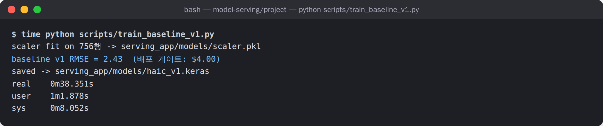
```
$ time python scripts/train_baseline_v1.py
scaler fit on 756행 -> serving_app/models/scaler.pkl
baseline v1 RMSE = 2.43  (배포 게이트: $4.00)
saved -> serving_app/models/haic_v1.keras
real    0m38.351s
```

⑥ /predict Try it out → 200

입력 2028-10-27 ~ 2028-11-23 (20거래일) → 예측 $191.68. 실제 다음 거래일(11-24) 종가 $192.71, 오차 $1.03.

⑦ 422 검증 오류 (19개 입력 / close=0)


⑧ /health의 Lazy / Eager 차이

| Lazy 첫 요청 이후 | Eager 기동 직후 |
|---|---|
|  |  |

⑨ Lazy vs Eager 측정표: 3-1 참조. 서버 콘솔:
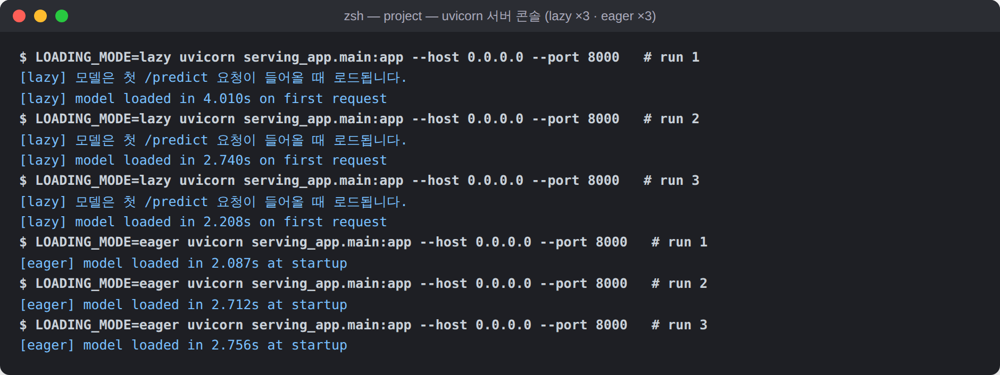

### 5-3. Day2 필수 증빙

① train_and_register 실행 로그
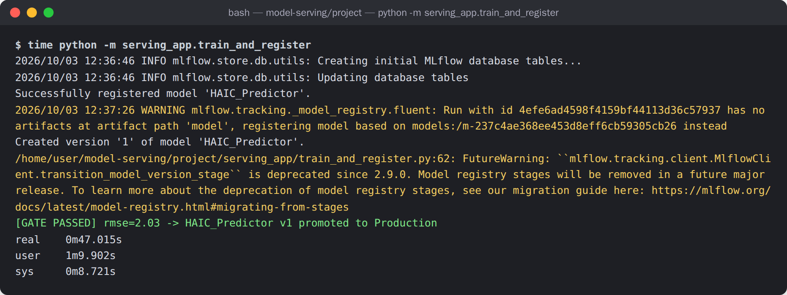
```
Successfully registered model 'HAIC_Predictor'.
Created version '1' of model 'HAIC_Predictor'.
[GATE PASSED] rmse=2.03 -> HAIC_Predictor v1 promoted to Production
real    0m47.015s
```
MLflow에는 `log_param`(mode, epochs)과 `log_metric("rmse")`가 run에 기록됐다. 백엔드는 sqlite(`mlflow.db`).

② _load_from_mlflow() 구현 (빈칸 5 포함)
```python
def _load_from_mlflow() -> LoadedModel:
    import mlflow.tensorflow
    keras_model = mlflow.tensorflow.load_model(MLFLOW_MODEL_URI)   # models:/HAIC_Predictor/Production
    scaler = HAICScaler.load(SCALER_PATH)                           # [빈칸 5] 다시 fit하지 않는다
    return LoadedModel(keras_model=keras_model, scaler=scaler, version=_production_version_label())
```

③ MODEL_SOURCE=mlflow 기동 후 /predict
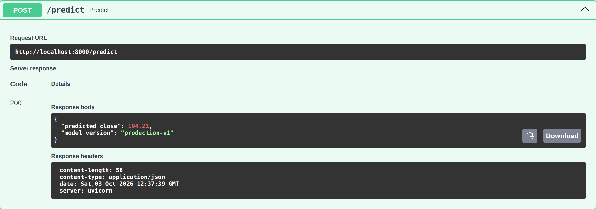
`v1-local`이 아니라 `production-v1`로 나오므로 MLflow에서 읽은 것이 확인된다. 같은 입력인데 Day1 로컬 모델은 191.68, Registry v1은 194.21이다. train_baseline과 train_and_register가 각각 따로 학습한 가중치이므로 값이 다른 것이 정상이다.

④ Docker

HAIC 컨테이너는 실행하지 못했다. 실습 환경에 docker 데몬이 없었기 때문이다. 대신 다음 두 가지로 확인했다.

- Dockerfile을 줄 단위로 분석했다. `COPY requirements.txt` → `pip install` 다음에 소스를 COPY하는 순서는 소스만 바뀌었을 때 의존성 레이어를 캐시에서 재사용하기 위한 것이다. 그 뒤 RUN 한 줄에서 `cp sample → data/uploads` → `train_baseline_v1.py` → `train_and_register.py`가 실행되어 이미지 안에 scaler.pkl, mlflow.db, Production v1까지 만들어진다. `ENV MODEL_SOURCE=mlflow`, `LOADING_MODE=eager`, 8000 포트. 이 RUN 단계를 같은 순서로 직접 실행한 결과가 5-2 ⑤와 5-3 ①의 로그다.
- 컨테이너 실행은 조별 과제(해아림) 이미지로 확인했다. `docker compose up --build` 87.6초, Eager 로드 0.576초, healthcheck healthy, Swagger `/predict` 200.

⑤ Day2를 ML 라이프사이클에 매핑

| 데이터 수집 | 학습 | 검증 | 배포 | 모니터링 |
|---|---|---|---|---|
| Day1 CSV 업로드 | MLflow Tracking | RMSE 게이트 | Registry 승격, Docker | Day3 |

### 5-4. Day3 필수 증빙

① 빈칸 구현 코드

`drift_detector.py` (빈칸 7, 8)
```python
def compute_rmse(recent_predictions):
    if not recent_predictions:
        return 0.0
    se = [(p["actual"] - p["predicted"]) ** 2 for p in recent_predictions]
    return math.sqrt(sum(se) / len(se))

def is_drift(recent_predictions):
    if len(recent_predictions) < WINDOW_SIZE:
        return False
    return compute_rmse(recent_predictions[-WINDOW_SIZE:]) > RMSE_THRESHOLD
```

`routers/predict.py` batch_test (빈칸 6)
```python
for i in range(len(prices) - SEQ_LEN):
    window = prices[i : i + SEQ_LEN]
    pred = model.predict_one([{"close": p, "volume": SIMULATED_VOLUME} for p in window])
    actual = prices[i + SEQ_LEN]
    recent_predictions.append({"predicted": pred, "actual": actual})
recent_predictions[:] = recent_predictions[-21:]
```
빈칸 6에서 actual을 `prices[i + SEQ_LEN - 1]`로 잡으면 창문 마지막 날을 맞힌 셈이 되어 RMSE가 비정상적으로 좋아진다. 주석의 질문대로 한 칸 차이가 look-ahead 누수다.

`retrain_trigger.py` (빈칸 9, 10, 11 + 4-7 수정분)
```python
rows = load_rows(latest_upload())[-(SEQ_LEN + 21):]     # 창문 20 + 정답 21 = 41행
result = fine_tune(rows)                                  # warm start
if result["promoted"]:
    logger.info(f"[OK] new_rmse={result['rmse']:.2f} - production promoted: HAIC_Predictor v{result['version']}")
    model_loader.invalidate_cache()                       # 4-7: 비우지 않으면 예전 모델이 계속 응답
    return {"status": "retrain_triggered", "promoted": True, "rmse": result["rmse"]}
return {"status": "retrain_triggered", "promoted": False, "rmse": result["rmse"]}
```

`scripts/simulate_drift.py` send_batch
```python
def send_batch(prices, label):
    resp = requests.post(API_URL, json={"prices": prices.tolist()}, timeout=600)
    resp.raise_for_status()
    result = resp.json()
    print(f"[{label}] drift_check = {result['drift_check']}")
    return result
```

② simulate_drift.py 실행 결과
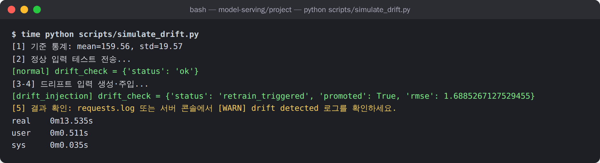
```
[1] 기준 통계: mean=159.56, std=19.57
[2] 정상 입력 테스트 전송...
[normal] drift_check = {'status': 'ok'}
[3-4] 드리프트 입력 생성·주입...
[drift_injection] drift_check = {'status': 'retrain_triggered', 'promoted': True, 'rmse': 1.6885267127529455}
```
드리프트 배치는 랜덤워크라 실행할 때마다 다르다. 여러 번 실행해 보면 재학습된 v2에 같은 3배 배치를 넣었을 때 `ok`로 통과하는 경우도 있었다. v2가 변동성이 큰 구간을 이미 학습했기 때문으로 보인다.

③ aiops.log (v2는 수정 전 재현, v3는 수정 후)
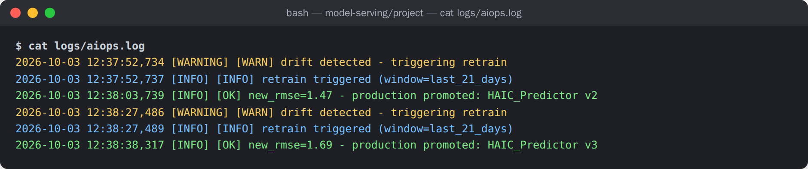
```
2026-10-03 12:37:52,734 [WARNING] [WARN] drift detected - triggering retrain
2026-10-03 12:37:52,737 [INFO] [INFO] retrain triggered (window=last_21_days)
2026-10-03 12:38:03,739 [INFO] [OK] new_rmse=1.47 - production promoted: HAIC_Predictor v2
2026-10-03 12:38:27,486 [WARNING] [WARN] drift detected - triggering retrain
2026-10-03 12:38:27,489 [INFO] [INFO] retrain triggered (window=last_21_days)
2026-10-03 12:38:38,317 [INFO] [OK] new_rmse=1.69 - production promoted: HAIC_Predictor v3
```
감지부터 승격까지 11초. 대시보드 재학습 로그 패널에 같은 여섯 줄이 표시된다. `routers/logs.py`가 같은 파일을 웹에서 읽어 주므로 터미널과 내용이 같다.
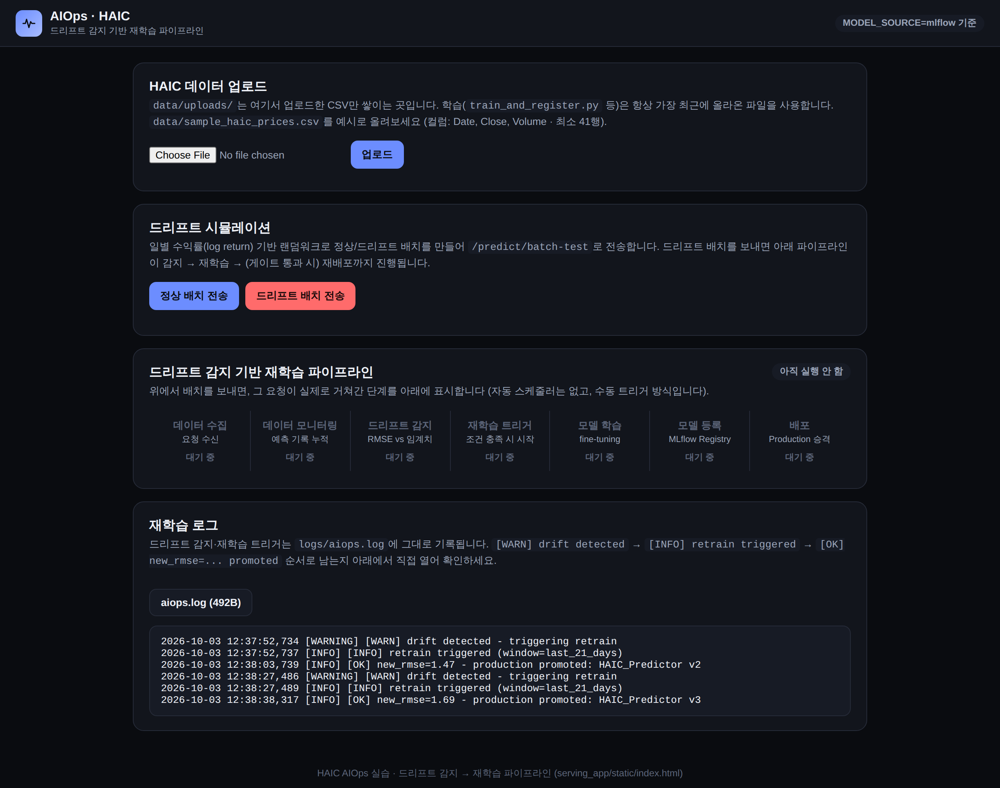

④ 재학습 후 /predict

수정 전 (invalidate_cache 호출만 주석, v2 승격 뒤에도 v1 응답)
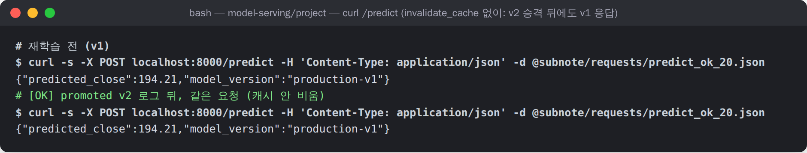

수정 후 (재기동 후 v2 → 드리프트 → v3, 재시작 없음)
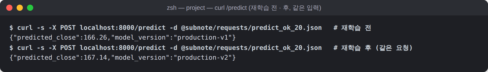


⑤ Registry 최종 상태
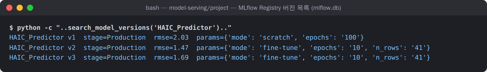

---

## 6. 빈칸 정리 (이 줄이 없으면)

교수님이 "에러 없이 결과만 틀어지는 자리에 빈칸을 뒀다"고 하셔서, 채우면서 각 줄이 없으면 어떻게 되는지 함께 정리했다.

| 빈칸 | 파일 | 채운 것 | 이 줄이 없으면 |
|---|---|---|---|
| 1 | train_baseline_v1.py | `model.fit(X_train, y_train_scaled, ...)` | test가 학습에 섞이면 RMSE가 실제보다 좋게 나온다 |
| 2 | model_loader.predict_one | `scaler.transform_point(close, volume)` | 정규화되지 않은 원값이 들어가 의미 없는 값 |
| 3 | 위와 같음 | `scaler.inverse_close(pred_scaled)` | 0.47 같은 정규화 값이 그대로 응답 |
| 4 | model_loader.get_model | `if _model_cache is None:` | 매 요청 모델을 새로 읽어 3초씩 지연 |
| 5 | _load_from_mlflow | `HAICScaler.load(SCALER_PATH)` | 다시 fit하면 가중치 기준과 어긋남 |
| 6 | predict.batch_test | `prices[i:i+SEQ_LEN]`, `prices[i+SEQ_LEN]` | 한 칸 어긋나면 look-ahead 누수 |
| 7 | compute_rmse | `sqrt(mean((actual-predicted)**2))` | $4 비교가 틀어짐 |
| 8 | is_drift | `len(...) < WINDOW_SIZE → False` | 표본 1~2건으로 판단해 오탐 |
| 9 | retrain_trigger | `[-(SEQ_LEN + 21):]` | 21행만 자르면 학습 샘플 1개 |
| 10 | 위와 같음 | `fine_tune(rows)` | 41행 scratch 학습은 불안정 |
| 11 | 위와 같음 | `if result["promoted"]:` | 탈락한 모델도 성공 로그 |
| 추가 | retrain_trigger | `model_loader.invalidate_cache()` | 4-7. 로그는 성공인데 서빙은 바뀌지 않음 |

---

## 7. 전체 회고

**실습 전에 알고 있던 것.** FastAPI로 모델을 감싸면 서비스가 된다는 정도. MLflow는 이름만 알았다. 드리프트는 통계 수업에서 분포가 바뀐다는 개념으로만 알았다.

**이번에 새로 배운 것.**

- Day1에서 서버가 떠 있는 것과 예측할 준비가 된 것이 다르다는 점을 Lazy 500 에러로 확인했다. 헬스체크가 있다는 것과 헬스체크가 무엇을 확인하는지는 다른 문제다.
- Day2에서 버전이 추상적인 개념이 아니라는 점을 확인했다. 몇 번 학습했는지가 v1, v2, v3로 그대로 남는다. 게이트는 생각보다 단순했다. `if score <= 4.00` 한 줄이다. 복잡한 장치가 아니라 기준을 숫자로 명확히 정해 두는 것이 핵심이었다.
- Day3가 가장 인상 깊었다. 4-7 캐시 문제는 처음에는 빈칸을 잘못 채운 것으로 생각했는데, 원인은 모듈 사이의 빈틈이었다. 로그를 남기는 모듈과 모델을 보관하는 모듈이 서로의 상태를 몰랐다. 실습가이드가 로그 확인에서 끝내지 않고 재배포 후 `/predict` 응답까지 확인하라고 한 이유를 이해했다.
- 교수님이 "왜 필요한지, 이 위치에서 이 요소 기술이 어떻게 연결되는지를 계속 물으면서 가라"고 하셨는데, 빈칸이 그런 지점에 배치되어 있었다. 문법을 몰라서 채우지 못하는 빈칸은 없었고, 왜 이 값이어야 하는지를 모르면 틀리게 채워도 실행은 되는 빈칸이었다.
- 포트 8000과 8077, venv 이름 같은 사소한 설정에서 시간을 적지 않게 썼다. README, Dockerfile, 스크립트 상수가 같은 값을 보는지 먼저 확인하는 습관이 생겼다.

**조별 과제(해아림)에 적용한 내용.**

HAIC 구조를 태양광 10곳의 다음 날 24시간 발전량 예측으로 옮겼다. 개인 실습에서 겪은 문제를 설계 단계부터 반영했다.

- 4-7 캐시 문제는 도메인이 바뀌어도 똑같이 생기는 문제이므로 승격 직후 캐시를 비우고, 응답에 실제 버전 번호를 넣었다.
- 4-5 경고와 4-6의 Production 중복 문제는 Stage 대신 alias(@champion)로 바꿔 함께 해결했다.
- 재학습을 요청 안에서 동기로 실행하면 그동안 `/predict`가 멈춘다는 내용이 부록 8번에 있었다. 백그라운드 스레드로 분리하고 `/jobs/current`로 상태를 조회하게 했다. 학습 중에도 기존 버전으로 응답하는 것을 캡처로 남겼다.
- 게이트는 RMSE 고정값이 아니라 "제도 오차 8% 통과율 0.45 이상"으로 바꿨다. 기준선이 0.30이므로 그 1.5배다. 드리프트 임계값도 검증 오차의 1.25배로 유도해 모델이 바뀌면 자동으로 따라가게 했다.
- HAIC에서는 "오차가 크면 재학습" 하나였는데, 실제 발전소 데이터를 넣어 보니 오차가 커지는 원인이 대부분 모델이 아니라 설비 고장이나 날씨였다. 그래서 재학습 전에 원인을 분류하는 단계를 추가했다. 지난 1년 실제 데이터에서 발생한 이상 세 건은 모두 설비 문제였고, 전부 재학습을 막는 것이 맞는 판단이었다. 재학습 루프 자체는 모의 시나리오로 검증했다.

**남은 의문.** 재학습 검증셋이 6일(4곳 × 6일 = 24 발전소-일)인데 이것이 충분한지 확신이 없다. 교수님 Q&A에도 "fine-tuning 후 게이트 RMSE는 믿을 만한가"가 있었다. 운영이라면 승격 뒤 며칠간 섀도로 함께 돌려 보는 단계가 더 필요할 것이다. 그리고 황사처럼 여러 지역이 동시에 떨어지는 날씨를 모델 드리프트로 오판할 가능성이 남아 있다.

**정리.** 모델을 만드는 것과 모델이 계속 맞게 운영하는 것은 다른 일이고, 그 사이를 잇는 것이 서빙, 게이트, 감시, 재학습이라는 네 가지 연결이었다.
